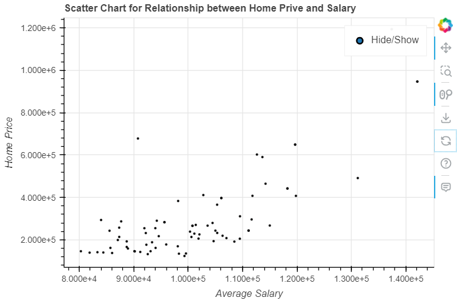
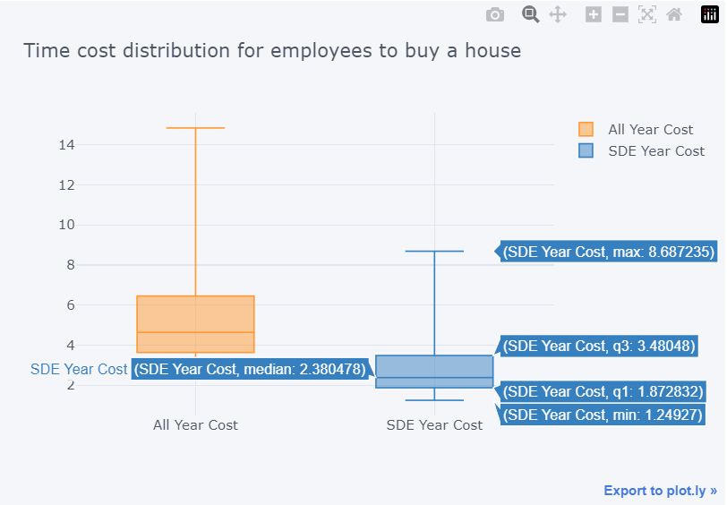
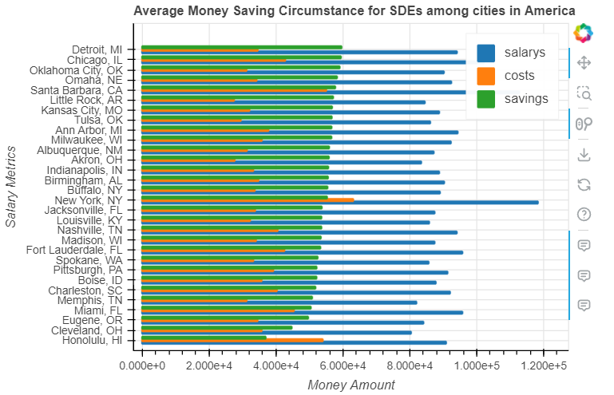
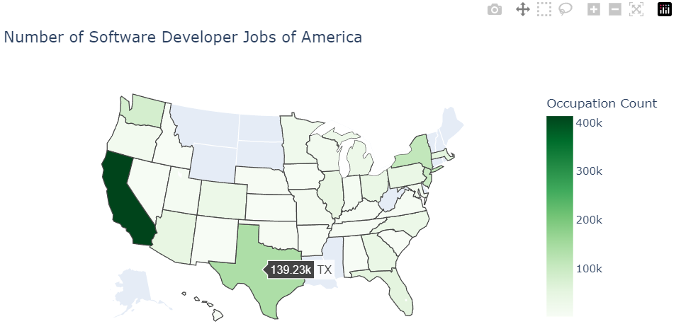
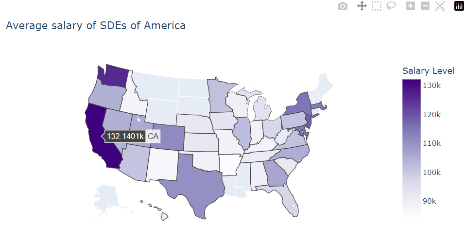

## CS5346 - OTOT - Task A3 - SDE Salary Vis of America
###### Student Name: Yang Xufeng $\quad$ Student Number: A0254371H
###### Submit Date: 2023.2.25

---

### 1. Problem and Dataset Description
$\,\quad$Software development engineers are considered to be one of the best paid careers in the world today, and the United States, the birthplace of the Internet, attracts the best people from around the world to work there with its booming technology businesses and high technological power. However, the size of the industry and salary levels also vary by region and city in the US, and given the different costs of living, people may have different views on the ideal place to work. The aim of this data visualisation project is to provide a visual representation of some of the key issues that matter to people and to inform and inspire their city and career choices.
$\,\quad$The dataset used for this project is from Kaggle and contains information on 77 US cities, including salary levels, number of jobs, house prices, cost of living, purchasing power and much more in 2022. We used a selection of this information and processed it appropriately to create interactive charts using pandas, bokeh and pyplot to visualise and analyse some of the issues of interest to the general public.
$\,\quad$My Implementation Link (contact me if you can not access it): https://nbviewer.org/github/Samsara-sd/CS5346_InfoVis/blob/main/OTOT-A/Task%20of%20Salary.ipynb
$\,\quad$Dataset Link: https://www.kaggle.com/datasets/thedevastator/u-s-software-developer-salaries

### 2. Visual Coding and Visualization Implementation
###### Query 1: "Home price concern: Relationship between Salary level and Home Price"
$\,\quad$For most workers, the largest single living expense comes from the purchase of a home. Affected by the financial markets, house prices in the US have shown an upward trend in recent years, creating new challenges for those wishing to purchase a home in the US. In this subtask, we want to show the relationship between wage levels and house prices and provide some assessment of how difficult it is for workers to buy a home.
$\,\quad$The graph below is presented as a scatter plot with the horizontal axis representing salary levels and the vertical axis representing house prices. As house prices are influenced by a number of factors, quantitatively analysing the relationship between these two attributes is difficult, so we can use the scatter plot to see the general trend.

$\,\quad$From the chart we can observe that when the wage level rises, house prices also show an upward trend. In cities where wages are greater than \$100,000, house price levels remain steadily above \$200,000 to \$400,000. This result is easy to understand as cities with higher wages tend to be more economically developed and therefore have higher home equity values.
$\,\quad$The chart below analyses the distribution of people's time use in saving up to buy a home. In practice, this question is influenced by many factors, such as total household income and taxes, and it is difficult to analyse precise statistical results from this dataset alone. We make a simple assumption here: assume that there are two workers in each household and that the entire pre-tax salary of one of them is used to budget for the purchase of a home (the other person's salary is used for daily expenses, savings, insurance purchases, tax payments, etc.). The analysis that follows is based on this hypothesis, but the analysis algorithm is scientific. If more precise data is available, the analysis here can be used to arrive at more realistic figures and conclusions.
$\,\quad$Given the characteristics of the data, box plots are very appropriate for use here. Our statistics are based on two dimensions: software engineers and the entire workforce, and are compared to show the average difficulty of buying a house for each group. The box plot shows the upper quartile, lower quartile and median values in a visual way, enabling a visual distribution of the time taken to accumulate the money for a house for both groups. The comparison shows that software engineers have a clear advantage in terms of salary levels and take nearly half the time to purchase a home compared to the general public average.

###### Query 2: "Livelihood concern: Which city is easier for software engineers to save money?"

$\,\quad$For workers, the rate of asset accumulation is a very important issue. Here we consider only wage accumulation, not other types of income. In cities where wages are higher, the cost of living expenses tend to be higher, so the speed of saving may not be the fastest.
$\,\quad$Using the wage level data and expenditure data provided in the dataset, we can calculate the expected annual balance and show the rate of asset accumulation for each city by sorting. In the bar chart below, the ranking is from top to bottom in order of the speed of saving from fastest to slowest. We can see that the cities with the highest wages are affected by expenditure and the speed of saving is not particularly impressive, while some cities with a combination of significant income and lower expenditure costs may be better suited to people's lives.

###### Query 3: "Career concern: Which city is suitable for software engineers to develop a career?"

### 3. Some important details in implementing this visualization
$\,\quad$